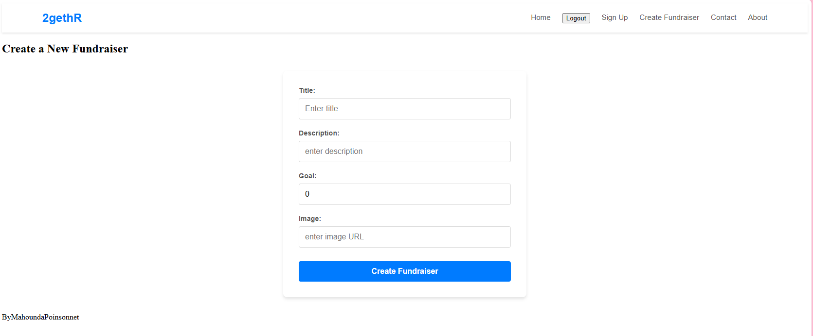
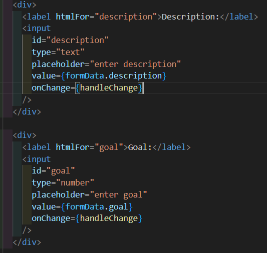
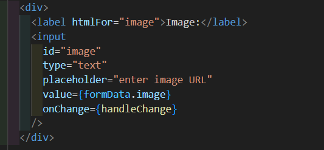
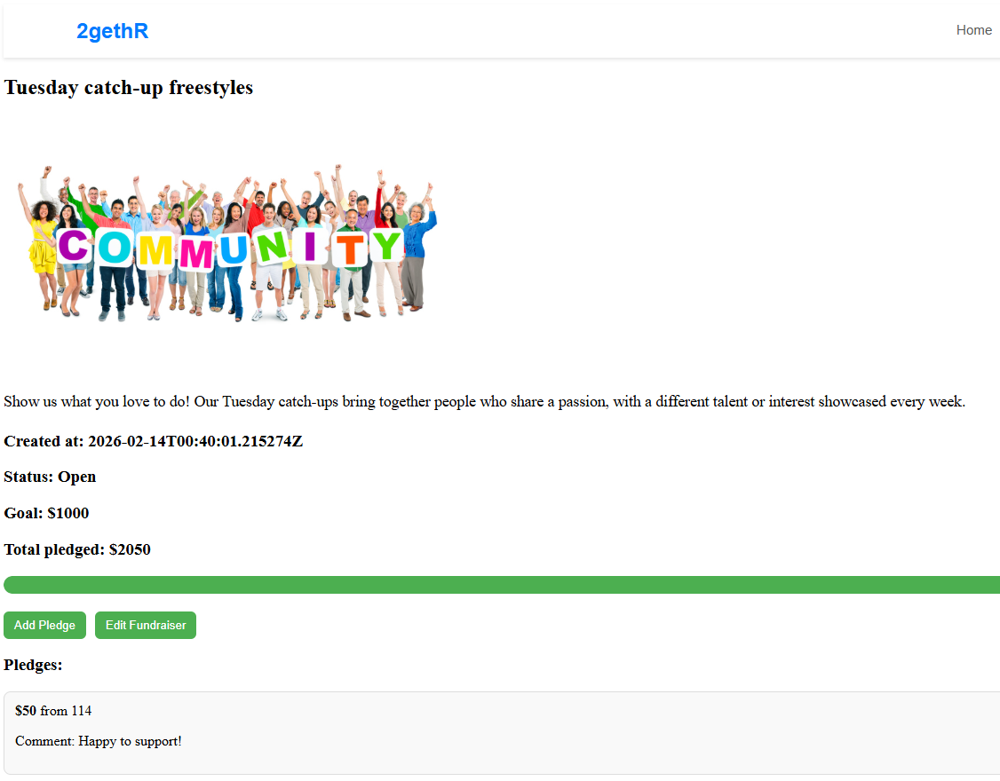
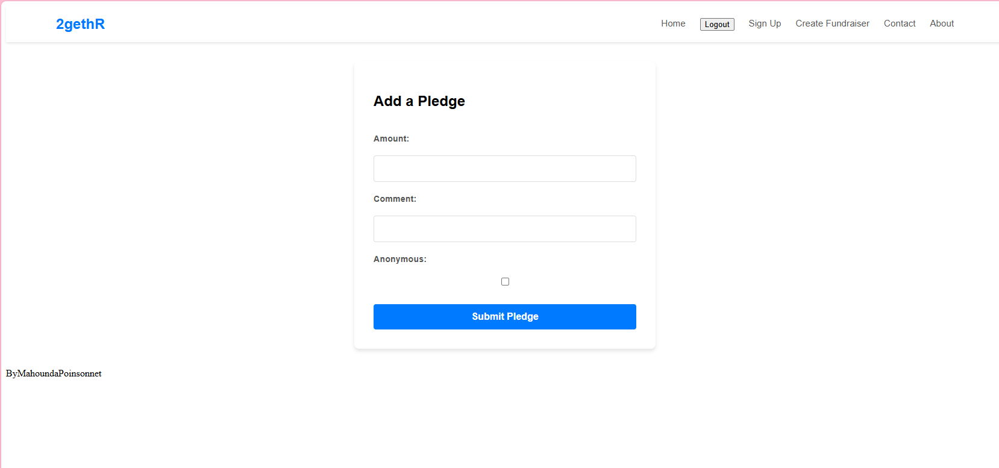
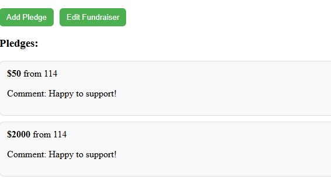
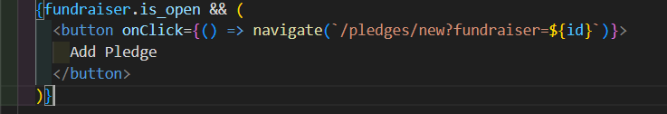
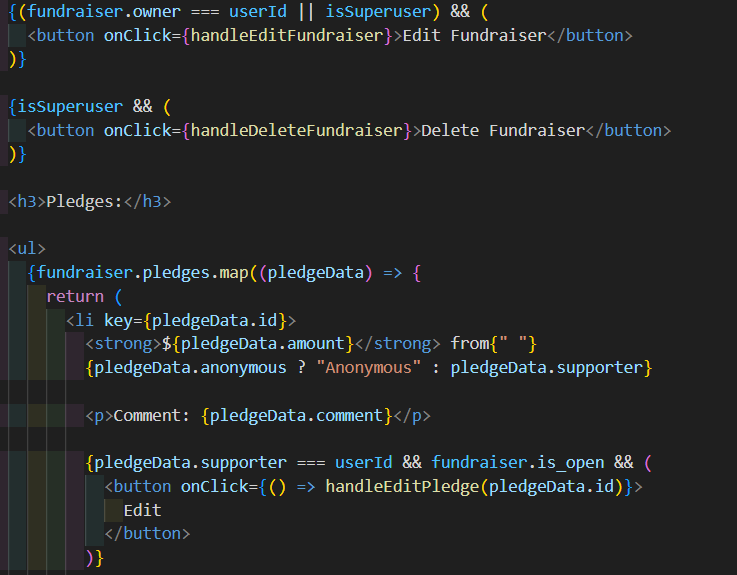
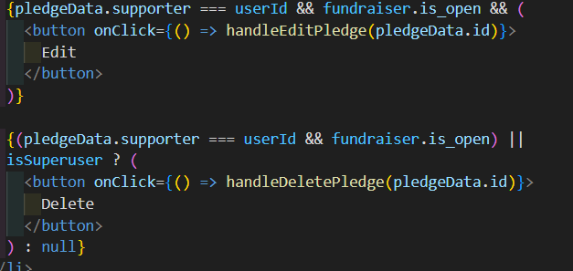
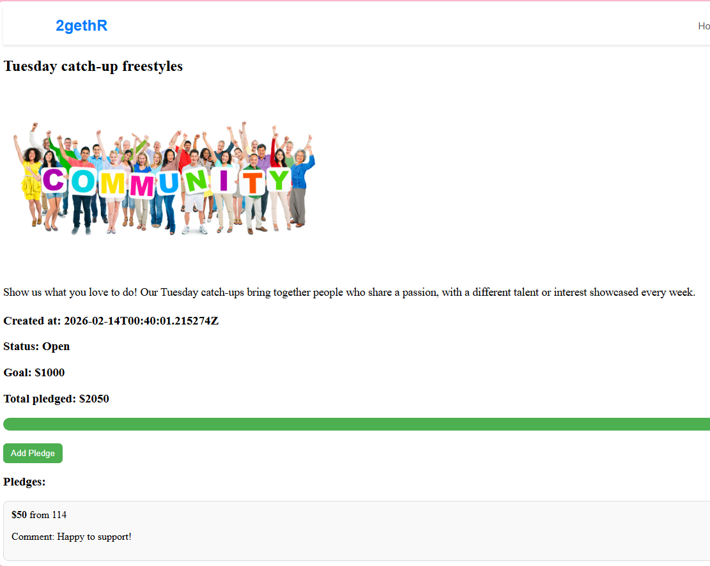

React Project: Crowdfunding App (Part 2)https://crowdfunding2getr.netlify.app/

 Have user accounts. A user should have at least the following attributes:
 Username
 Email address
 Password
 https://crowdfunding2getr.netlify.app/signup

 Ability to create a “fundraiser” to be crowdfunded which will include at least the following attributes:
 Title
 Owner (a user)
 Description
 Image
 Target amount to raise
 src/components/FundraiserForm.jsx
https://crowdfunding2getr.netlify.app/fundraisers/create

 Whether it is currently open to accepting new supporters or not/ When the fundraiser was created
 
 https://crowdfunding2getr.netlify.app/fundraisers/45

 Ability to “pledge” to a fundraiser. A pledge should include at least the following attributes:
 An amount
 The fundraiser the pledge is for
 The supporter/user (i.e. who created the pledge)
 Whether the pledge is anonymous or not
 A comment to go along with the pledge

https://crowdfunding2getr.netlify.app/pledges/new?fundraiser=45

 Implement suitable update/delete functionality, e.g. should a fundraiser owner be allowed to update its description?
 Implement suitable permissions, e.g. who is allowed to delete a pledge?
 src/components/FundraiserPage.jsx

Only open fundraisers allow new pledges

Owners can update their fundraiser
Superusers can update any fundraisers
Only super user can delete fundraisers

Only supporter can edit their pledge
Supporter or super user can delete their pledge  (super user all pledges) 

A screenshot of the resulting page when an unauthorized user attempts to edit a fundraiser (optional, depending on whether or not this functionality makes sense in your app!)

User can only view the page, add some pledges but cannot edit
https://crowdfunding2getr.netlify.app/fundraisers/45