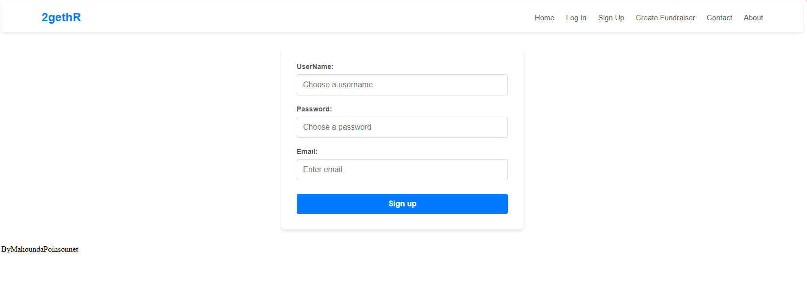

React Project: Crowdfunding App (Part 2)https://crowdfunding2getr.netlify.app/

 Have user accounts. A user should have at least the following attributes:
 Username
 Email address
 Password
 https://crowdfunding2getr.netlify.app/signup

 Ability to create a “fundraiser” to be crowdfunded which will include at least the following attributes:
 Title
 Owner (a user)
 Description
 Image
 Target amount to raise
 Whether it is currently open to accepting new supporters or not
 When the fundraiser was created
 Ability to “pledge” to a fundraiser. A pledge should include at least the following attributes:
 An amount
 The fundraiser the pledge is for
 The supporter/user (i.e. who created the pledge)
 Whether the pledge is anonymous or not
 A comment to go along with the pledge
 Implement suitable update/delete functionality, e.g. should a fundraiser owner be allowed to update its description?
 Implement suitable permissions, e.g. who is allowed to delete a pledge?
 Return the relevant status codes for both successful and unsuccessful requests to the API.
 Handle failed requests gracefully (e.g. you should have a custom 404 page rather than the default error page).
 Use Token Authentication, including an endpoint to obtain a token along with the current user's details.
 Implement responsive design.
Additional Notes
No additional libraries or frameworks, other than what we use in class, are allowed unless approved by the Lead Mentor.

Note that while this is a crowdfunding website, actual money transactions are out of scope for this project.

Submission
To submit, fill out this Google form, including a link to your Github repo. Your lead mentor will respond with any feedback they can offer, and you can approach the mentoring team if you would like help to make improvements based on this feedback!

Please include the following in your readme doc:

 A link to the deployed project.
 A screenshot of the homepage
 A screenshot of the fundraiser creation page
 A screenshot of the fundraiser creation form
 A screenshot of a fundraiser with pledges
 A screenshot of the resulting page when an unauthorized user attempts to edit a fundraiser (optional, depending on whether or not this functionality makes sense in your app!)